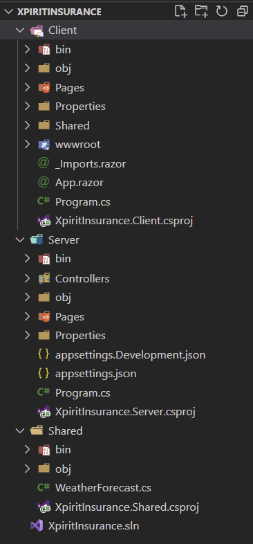
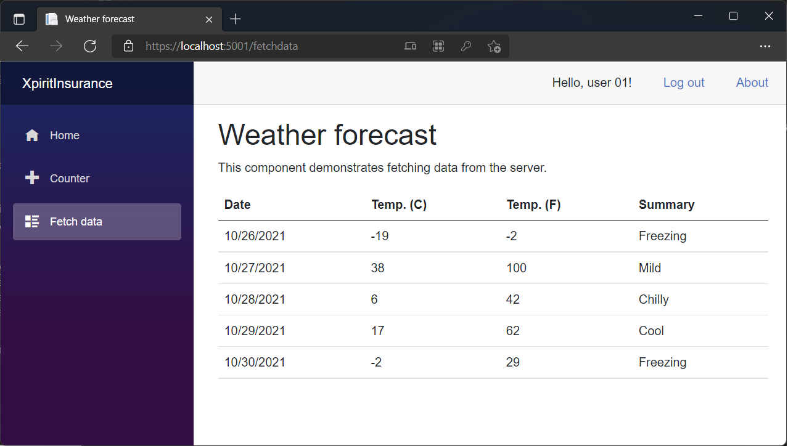

# Building a modern web application using Blazor

In this Lab, we will first create a new Blazor application. It will be an application that authenticates with Azure AD B2C (hosted by Xpirit), and uses an Azure Store account (also hosted by Xpirit) or [Azurite](https://docs.microsoft.com/en-us/azure/storage/common/storage-use-azurite?tabs=visual-studio#install-and-run-azurite).

## Prerequisites
Make sure you have completed [Lab 1 - Getting started](Lab1-GetttingStarted.md)

## Prepare a workspace

> This option will get you started quickly but includes some manual work. Alternatively, you can use the completed solution in this repo and deploy it to Azure in [Lab 3 - Infrastructure as Code using Bicep](Lab3-Bicep.md). Note that by doing this, you will effectively skip this entire Lab.

- Create a new folder to host the project. E.g. `d:\projects\clubcloud`
- Open a terminal and navigate to the folder. E.g. `cd d:\projects\clubcloud`
- Run this command to generate a skeleton project:

```
dotnet new blazorwasm -au IndividualB2C --aad-b2c-instance "https://xpiritinsurance.b2clogin.com/" --api-client-id "3b551417-548e-4e8e-80c3-44bb06f3aa64" --app-id-uri "3b551417-548e-4e8e-80c3-44bb06f3aa64" --client-id "e280fc38-2898-4fad-baaf-fbeb1d306bd1" --default-scope "API.Access" --domain "xpiritinsurance.onmicrosoft.com" -ho -o XpiritInsurance -ssp "B2C_1_UserFlowSuSi"
```

> This will scaffold a new Blazor solution, configured to use the Xpirit Insurance demo Azure AD B2C environment.
Move your terminal to the root folder of the generated project before continuing.

## Changing the scaffolded code

You will now change the scaffolded code to look like a (very basic) insurance selling web site.
Please examine the generated code; you should see a folder named 'XpiritInsurance'. Inside the folder, you should see three subfolders containing 3 C# projects.



1. **Client** - This folder contains the code that will be executed in the browser of the end user. It contains screens and logic that calls Web API's.
2. **Server** - This folder contains the code that will run on the server. It contains Web API controllers.
3. **Shared** - This folder contains code that is accessible for both the Client and the Server. It holds shared class definitions.

### Modify the Server project

Our Xpirit hosted Azure AD B2C tenant is configured to accept certain predefined URL's to return tokens to. To comply with this, you will need to adjust the port that the website uses.
Open the file `Properties\launchsettings.json` in the 'Server' project, by using VS Code or Visual Studio 2022:

```
cd XpiritInsurance
code .
```

Open the file '\Server\Properties\launchSettings.json'

Modify the `applicationUrl` value on line 16, in the section named `XpiritInsurance`:

```json
"applicationUrl": "https://localhost:7293;http://localhost:5088",
```

into:
```json
"applicationUrl": "https://localhost:5001;http://localhost:5000",
```

> Notice the updated port numbers.

#### Configure Web API Controller Scopes

Still inside the 'Server' project, open the file 'Controllers\WeatherForecastController.cs'.
On line 11, change the attribute code from:

```csharp
[RequiredScope(RequiredScopesConfigurationKey = "AzureAd:Scopes")]
```

into:
```csharp
[RequiredScope(RequiredScopesConfigurationKey = "AzureAdB2C:Scopes")]
```
> Notice the changed configuration section name.

In the same project change the configuration to define the required API scope. Modify the file 'appsettings.json' from:

```json
{
"AzureAdB2C": {
    "Instance": "https://xpiritinsurance.b2clogin.com/",
    "ClientId": "3b551417-548e-4e8e-80c3-44bb06f3aa64",
    "Domain": "xpiritinsurance.onmicrosoft.com",
    "SignUpSignInPolicyId": "B2C_1_UserFlowSuSi"
},
```

into this:

```json
{
"AzureAdB2C": {
    "Instance": "https://xpiritinsurance.b2clogin.com/",
    "ClientId": "3b551417-548e-4e8e-80c3-44bb06f3aa64",
    "Domain": "xpiritinsurance.onmicrosoft.com",
    "SignUpSignInPolicyId": "B2C_1_UserFlowSuSi",
    "Scopes": "API.Access"
},
```
> Notice the added `Scopes` value.

Delete comments from the JSON file if present.

```json
/*
The following identity settings need to be configured
before the project can be successfully executed.
For more info see https://aka.ms/dotnet-template-ms-identity-platform
*/
```
### Modify the Client App
Open the file `Program.cs` in the 'Client' project.

Modify the `LoginMode` so users are redirected to login, instead of showing a pop-up window:

Change:
```csharp
builder.Services.AddMsalAuthentication(options =>
{
    builder.Configuration.Bind("AzureAdB2C", options.ProviderOptions.Authentication);
    options.ProviderOptions.DefaultAccessTokenScopes.Add("https://xpiritinsurance.onmicrosoft.com/3b551417-548e-4e8e-80c3-44bb06f3aa64/API.Access");
});
```
into: 

```csharp
builder.Services.AddMsalAuthentication(options =>
{
    builder.Configuration.Bind("AzureAdB2C", options.ProviderOptions.Authentication);
    options.ProviderOptions.DefaultAccessTokenScopes.Add("https://xpiritinsurance.onmicrosoft.com/3b551417-548e-4e8e-80c3-44bb06f3aa64/API.Access");
    options.ProviderOptions.LoginMode = "redirect";
});
```

> Notice the added line to configure `redirect` as `LoginMode` on line 20.

Modify the project file 'XpiritInsurance.Client.csproj' and exempt the reference `Microsoft.Authentication.WebAssembly.Msal' from trimming by adding a new element named `TrimmerRootAssembly` at the bottom of the section.

Change the references from:
```xml
<ItemGroup>
    <PackageReference Include="Microsoft.AspNetCore.Components.WebAssembly" Version="6.0.0-rc.1.21452.15" />
    <PackageReference Include="Microsoft.AspNetCore.Components.WebAssembly.DevServer" Version="6.0.0-rc.1.21452.15" PrivateAssets="all" />
    <PackageReference Include="Microsoft.Authentication.WebAssembly.Msal" Version="6.0.0-rc.1.21452.15" />
    <PackageReference Include="Microsoft.Extensions.Http" Version="6.0.0-rc.1.21451.13" />
</ItemGroup>
```
into this:

```xml
<ItemGroup>
    <PackageReference Include="Microsoft.AspNetCore.Components.WebAssembly" Version="6.0.0-rc.1.21452.15" />
    <PackageReference Include="Microsoft.AspNetCore.Components.WebAssembly.DevServer" Version="6.0.0-rc.1.21452.15" PrivateAssets="all" />
    <PackageReference Include="Microsoft.Authentication.WebAssembly.Msal" Version="6.0.0-rc.1.21452.15" />
    <PackageReference Include="Microsoft.Extensions.Http" Version="6.0.0-rc.1.21451.13" />
    <TrimmerRootAssembly Include="Microsoft.Authentication.WebAssembly.Msal"  />
</ItemGroup>
```

> Notice the added `TrimmerRootAssembly` on line 14, which ensures that Msal is included in the published output.

## Test your code
Your project should now compile and run without errors. 

### Using Visual Studio Code
Use 'F5' to start debugging, select the 'Server' project when asked.

Alternatively, use the built-in Terminal to run the command `dotnet run` from the 'Server' project folder, to ensure everything works.

### Using Visual Studio
Start debugging by pressing F5 or select `Start debugging` from the `Debug` menu. Or select the option to run without debugging.

### Using a Browser

Use a web browser to navigate to https://localhost:5001

Log in using username `user01@xpiritinsurance.com` and the password provided by the proctors.

Navigate to [Fetch data](https://localhost:5001/fetchdata) to assert that everything works as expected. If all is well, you should see some random weather data.



# Another round of adding custom code
We will now change the code again. This time, to create some insurance selling functionality.

To do this, we will add a Web API controller that can serve insurance quotes, and be used to purchase & view insurances.

## Add shared code to the 'Shared' project

The 'Shared' project contains code that is available to both Client and Server. This is a great place to store objects that are serialized and sent over the network from client to server or v.v.

In Visual Studio, or VS Code, open the project 'XpiritInsurance.Shared' and add these files:

- Insurance.cs
    ```csharp
    namespace XpiritInsurance.Shared;
    public record Insurance(InsuranceType InsuranceType, decimal AmountPerMonth);
    ```
- InsuranceType.cs
    ```csharp
    namespace XpiritInsurance.Shared;
    public enum InsuranceType { House, Boat, Health }
    ```
- Quote.cs
    ```csharp
    namespace XpiritInsurance.Shared;
    public record Quote(string UserName, InsuranceType InsuranceType, decimal AmountPerMonth);
    ```
> Don't forget to save the changes.
## Add Web API code to the 'Server' project
You will now add a new API Controller to the project, this will manage insurances in (fake) storage.

Create a folder named 'Services' in the root of the 'Server' project. Make sure that it is created at the same level as the 'Controllers' folder that is already present.
- Add a Nuget Package reference to include 'Microsoft.Experimental.Collections':
```
cd .\Server
dotnet add package Microsoft.Experimental.Collections -v 1.0.6-e190117-3
```

Still inside the Server project, add a new API Controller:

- Controllers\InsuranceController.cs
    ```csharp
    using System.Net;
    using Microsoft.AspNetCore.Authorization;
    using Microsoft.AspNetCore.Mvc;
    using Microsoft.Identity.Web;
    using Microsoft.Identity.Web.Resource;
    using XpiritInsurance.Server.Services;
    using XpiritInsurance.Shared;

    namespace XpiritInsurance.Server.Controllers;

    [RequiredScope(RequiredScopesConfigurationKey = "AzureAdB2C:Scopes")]
    [ApiController]
    [Route("[controller]")]
    public class InsuranceController : ControllerBase
    {
        private readonly ILogger<InsuranceController> _logger;
        private readonly QuoteAmountService _quoteAmountService;
        private readonly InsuranceService _insuranceService;

        public InsuranceController(ILogger<InsuranceController> logger, QuoteAmountService quoteAmountService, InsuranceService insuranceService)
        {
            _logger = logger ?? throw new ArgumentNullException(nameof(logger));
            _quoteAmountService = quoteAmountService ?? throw new ArgumentNullException(nameof(quoteAmountService));
            _insuranceService = insuranceService ?? throw new ArgumentNullException(nameof(insuranceService));
        }

        [ProducesResponseType((int)HttpStatusCode.OK, Type = typeof(IEnumerable<Insurance>))]
        [HttpGet]
        public async Task<IActionResult> GetInsurances()
        {
            string userName = HttpContext.User.GetDisplayName() ?? "unknown";
            var insurances = await _insuranceService.GetInsurances(userName);
            return Ok(insurances);
        }

        [ProducesDefaultResponseType]
        [HttpPost]
        public async Task<IActionResult> BuyInsurance(Quote quote)
        {
            string userName = HttpContext.User.GetDisplayName() ?? "unknown";
            decimal amount = quote.AmountPerMonth;
            if (amount < 5 || amount > 150)
            {
                amount = await _quoteAmountService.CalculateQuote(userName, quote.InsuranceType);
            }
            await _insuranceService.AddInsurance(quote with { UserName = userName, AmountPerMonth = amount });

            _logger.LogInformation("Sold insurance {InsuranceType} to user {UserName} for {AmountPerMonth}", quote.InsuranceType, userName, amount);
            return Ok();
        }

        [ProducesResponseType((int)HttpStatusCode.OK, Type = typeof(Quote))]
        [HttpGet("quote")]
        public async Task<IActionResult> CalculateQuote(InsuranceType insuranceType)
        {
            string userName = HttpContext.User.GetDisplayName() ?? "unknown";
            decimal amount = await _quoteAmountService.CalculateQuote(userName, insuranceType);

            return Ok(new Quote(userName, insuranceType, amount));
        }
    }
    ```


Add a fake storage service class:

- Services\InsuranceService.cs
    ```csharp
    using Microsoft.Collections.Extensions;
    using XpiritInsurance.Shared;
    namespace XpiritInsurance.Server.Services;

    public class InsuranceService
    {
        private readonly MultiValueDictionary<string, Insurance> Data = new()
        {
            { "user 01", new Insurance(InsuranceType.Boat, 15) },
            { "user 02", new Insurance(InsuranceType.House, 50) }
            //add some seed data
        };

        public Task<IReadOnlyCollection<Insurance>> GetInsurances(string userName)
        {
            IReadOnlyCollection<Insurance> result = Array.Empty<Insurance>();
            if (Data.TryGetValue(userName, out var insurances))
            {
                result = insurances;
            }
            return Task.FromResult(result);
        }

        public virtual Task<Insurance> AddInsurance(Quote quote)
        {
            if (Data.TryGetValue(quote.UserName, out var insurances) && insurances.Any(i => i.InsuranceType == quote.InsuranceType))
            {
                var existing = insurances.Single(i => i.InsuranceType == quote.InsuranceType);
                var copy = existing with
                {
                    AmountPerMonth = quote.AmountPerMonth
                };
                Data.Remove(quote.UserName, existing);
            }


            Insurance insurance = new Insurance(quote.InsuranceType, quote.AmountPerMonth);
            Data.Add(quote.UserName, insurance);
            return Task.FromResult(insurance);
        }
    }
    ```

Add a fake insurance quote-amount service class:

- Services\QuoteAmountService.cs
    ```csharp
    using XpiritInsurance.Shared;
    namespace XpiritInsurance.Server.Services;

    public class QuoteAmountService
    {
        public virtual Task<decimal> CalculateQuote(string userName, InsuranceType insuranceType)
        {
            decimal amount = 0M;
            switch (insuranceType)
            {
                case InsuranceType.House:
                    amount = new Random().Next(30, 70);
                    break;
                case InsuranceType.Boat:
                    amount = new Random(Guid.NewGuid().GetHashCode()).Next(5, 15);
                    break;
                case InsuranceType.Health:
                    amount = new Random(Guid.NewGuid().GetHashCode()).Next(79, 150);
                    break;
            }

            return Task.FromResult<decimal>(amount);
        }
    }
    ```

Register the services for Dependency Injection:

- Open the file 'program.cs' to register the 2 newly added (mock) services:
      On line 14, below `builder.Services.AddRazorPages();`, insert these new lines of code:
    ```csharp
    //Add mock services
    builder.Services.AddSingleton<XpiritInsurance.Server.Services.QuoteAmountService>();
    builder.Services.AddSingleton<XpiritInsurance.Server.Services.InsuranceService>();
    ```

### Test your changes

Your project should now compile and run without errors. Use the [same test method](#test-your-code) as before, to ensure everything works.


## Add some Blazor code to the 'Client' project

You will now add an open-source library named 'MudBlazor' to the Client project, that offers some useful controls to use on your pages. This way, we can create a nice user interface without effort.

### Configure MudBlazor library

- Add the MudBlazor Nuget package to the Client project for some nice UI components:
    ```
    cd ..\Client
    dotnet add package MudBlazor -v 5.1.5
    ```

- Open the file named '_Imports.razor' in the Client folder, and add MudBlazor to the bottom of the file:

    ```
    @using MudBlazor
    ```

- Open the existing file 'App.razor' in the Client folder, and register MudBlazor components, by adding these MudBlazor Providers at the bottom of the file, **after** the element named `</CascadingAuthenticationState>`:

    ```xml
    <CascadingAuthenticationState>..</CascadingAuthenticationState>

    <MudThemeProvider/>
    <MudDialogProvider/>
    <MudSnackbarProvider/>
    ```

- Open the file 'wwwroot/index.html' and add this snippet in the `head` section:

    ```html
    <link href="https://fonts.googleapis.com/css?family=Roboto:300,400,500,700&display=swap" rel="stylesheet" />
    <link href="_content/MudBlazor/MudBlazor.min.css" rel="stylesheet" />
    ```
- Next, add this snippet to the end `body` section:
    ```
    <script src="_content/MudBlazor/MudBlazor.min.js"></script>
    ```

- As a final step to configure the MudBlazor library, enable the services inside 'Program.cs' **before** this code `await builder.Build().RunAsync();`:

    ```csharp
    //line 1:
    using MudBlazor.Services;
    //line 23:
    builder.Services.AddMudServices();
    ```

### Add UI components

We will now add some User Interface components that interact with the Web API's to allow users to buy insurance.
The first page will fetch a user's existing insurances from the API and display them.

- Add a component 'Pages/Insurances.razor' (in the same folder that holds the scaffolded component 'Index.razor'):

    ```csharp
    @page "/insurances"
    @using Microsoft.AspNetCore.Authorization
    @using Microsoft.AspNetCore.Components.WebAssembly.Authentication
    @using XpiritInsurance.Shared
    @attribute [Authorize]
    @inject HttpClient Http

    <h1>Insurance</h1>

    <div class="contentDiv">
    @if (_insurances == null)
    {
        <p><em>Loading...</em></p>
    }
    else
    {
        <MudSimpleTable Style="overflow-x: auto;" Hover="true" Striped="true">
            <thead>
                <tr>
                    <th>Insurance</th>
                    <th>Monthly amount</th>
                </tr>
            </thead>
            <tbody>
                @foreach (var insurance in _insurances)
                {
                    <tr>
                        <td>@insurance.InsuranceType</td>
                        <td>@insurance.AmountPerMonth</td>
                    </tr>
                }
            </tbody>
        </MudSimpleTable>
    }

    @if (_hasError)
    {
        <MudAlert Severity="Severity.Error">@_message</MudAlert>
    }

    </div>

    @if (_isLoading)
    {
        <MudProgressCircular Color="Color.Primary" Indeterminate="true"/>
    }


    @code {
        private List<Insurance> _insurances = new();
        private bool _hasError = false;
        private bool _isLoading = false;
        private string? _message;

        protected override async Task OnInitializedAsync()
        {
            _hasError = false;
            _isLoading = true;
            try
            {
                var data = await Http.GetFromJsonAsync<IEnumerable<Insurance>>("insurance");
                if (data != null) _insurances.AddRange(data);_insurances.AddRange(data);
            }
            catch (AccessTokenNotAvailableException exception)
            {
                exception.Redirect();
            }
            catch (Exception ex)
            {
                _hasError = true;
                _message = ex.Message;
            }
            finally
            {
                _isLoading = false;
            }
        }
    }
    ```

The second page will fetch quotes for new insurances from the API and display them, so the user can buy one.

- Add a component 'Pages/Quotes.razor':

    ```csharp
    @page "/quotes"
    @using Microsoft.AspNetCore.Authorization
    @using Microsoft.AspNetCore.Components.WebAssembly.Authentication
    @using XpiritInsurance.Shared
    @attribute [Authorize]
    @inject HttpClient Http

    <h1>Quotes</h1>

    <div class="contentDiv">
    <MudSimpleTable Style="overflow-x: auto;" Hover="true" Striped="true">
        <thead>
            <tr>
                <th>Insurance Type</th>
                <th>Amount per mont</th>
                <th>Quote</th>
                <th>Buy</th>
            </tr>
        </thead>
        <tbody>
        @foreach (var quote in _quotes)
        {
        <tr>
        <td>@quote.Key</td>
        <td>@quote.Value</td>
        <td><MudButton Variant="Variant.Filled" DisableElevation="true" Color="Color.Primary" @onclick="() => GetQuote(quote.Key)">Get quote</MudButton></td>
        <td><MudButton Variant="Variant.Filled" DisableElevation="true" Color="Color.Primary" @onclick="() => Buy(quote.Key)">Buy this</MudButton></td>
        </tr>
        }
    </tbody>
    </MudSimpleTable>

    @if (_hasError)
    {
        <MudAlert Severity="Severity.Error" >@_message</MudAlert>
    }
    else if (_hasSuccess)
    {
        <MudAlert Severity="Severity.Info">@_message</MudAlert>
    }

    </div>

    @if (_isLoading)
    {
        <MudProgressCircular Color="Color.Primary" Indeterminate="true"/>
    }

    @code {

        private Dictionary<string, decimal?> _quotes = new();
        private bool _hasError = false;
        private bool _hasSuccess = false;
        private bool _isLoading = false;
        private string? _message;


        protected override void OnInitialized()
        {
            foreach (var insuranceType in Enum.GetNames(typeof(InsuranceType)))
            {
                _quotes.Add(insuranceType, null);
            }

            base.OnInitialized();
        }

        private async Task GetQuote(string insuranceType)
        {
            try
            {
                _isLoading = true;
                _hasError = false;
                _hasSuccess = false;

                var quote = await Http.GetFromJsonAsync<Quote>($"insurance/quote?insuranceType={insuranceType}");
                if (quote != null) _quotes[insuranceType] = quote.AmountPerMonth;_quotes[insuranceType] = quote.AmountPerMonth;
            }
            catch (AccessTokenNotAvailableException exception)
            {
                exception.Redirect();
            }
            catch (Exception ex)
            {
                _hasError = true;
                _message = ex.Message;
            }
            finally
            {
                _isLoading = false;
            }
        }

        private async Task Buy(string insuranceType)
        {
            try
            {
                _hasError = false;
                _hasSuccess = false;
                _isLoading = true;
                _message = null;

                var it = (InsuranceType)Enum.Parse(typeof(InsuranceType), insuranceType);
                if (_quotes.TryGetValue(insuranceType, out var amount) && amount.HasValue)
                {
                    var response = await Http.PostAsJsonAsync<Quote>($"insurance", new Quote("", it, amount.Value));
                    response.EnsureSuccessStatusCode();
                    _message = $"Bought {insuranceType} insurance for {amount.Value}€ per month.";
                    _hasSuccess = true;
                }
                else
                {
                    _message = "Get a quote first!";
                    _hasError = true;
                    
                }
            }
            catch (AccessTokenNotAvailableException exception)
            {
                exception.Redirect();
            }
            catch (Exception ex)
            {
                _hasError = true;
                _message = ex.Message;
            }
            finally
            {
                _isLoading = false;
            }
        }
    }
    ```

- Open the file 'Shared\NavMenu.razor' to add the new components to the menu.
Change the code from this:
    ```html
    <div class="@NavMenuCssClass" @onclick="ToggleNavMenu">
        <nav class="flex-column">
            <div class="nav-item px-3">
                <NavLink class="nav-link" href="" Match="NavLinkMatch.All">
                    <span class="oi oi-home" aria-hidden="true"></span> Home
                </NavLink>
            </div>
            <div class="nav-item px-3">
                <NavLink class="nav-link" href="counter">
                    <span class="oi oi-plus" aria-hidden="true"></span> Counter
                </NavLink>
            </div>
            <div class="nav-item px-3">
                <NavLink class="nav-link" href="fetchdata">
                    <span class="oi oi-list-rich" aria-hidden="true"></span> Fetch data
                </NavLink>
            </div>
        </nav>
    </div>
    ```
    into this:
    ```html
    <div class="@NavMenuCssClass" @onclick="ToggleNavMenu">
        <nav class="flex-column">
            <div class="nav-item px-3">
                <NavLink class="nav-link" href="" Match="NavLinkMatch.All">
                    <span class="oi oi-home" aria-hidden="true"></span> Home
                </NavLink>
            </div>
            <div class="nav-item px-3">
                <NavLink class="nav-link" href="insurances">
                    <span class="oi oi-plus" aria-hidden="true"></span> My insurances
                </NavLink>
            </div>
            <div class="nav-item px-3">
                <NavLink class="nav-link" href="quotes">
                    <span class="oi oi-list-rich" aria-hidden="true"></span> My quotes
                </NavLink>
            </div>
        </nav>
    </div>
    ```
    > Notice the changed menu item URLs and names.

### Test insurance selling

Your project should now compile and run without errors. Use the [same test method](#test-your-code) as before.

- Instead of using 'Fetch data', navigate to  [My quotes](https://localhost:5001/quotes)

- Look at [My insurances](https://localhost:5001/insurances) to see your current insurances
- Click on any of the 'Get Quote'
- Click on 'Buy This' for which a quote was fetched
- Navigate to [My insurances](https://localhost:5001/insurances) to see your new insurances

# Even more modifications - adding a Storage Queue
If everything works properly, you can add some Cloud functionality to the app.

### Server Project
We will now modify the Web API code in the 'Server' project, to send a message to an Azure Storage Queue when an insurance is sold. This way, remote systems can process the information.

In the Server project, add a Nuget package to enable use of Azure Storage Queues:

```
cd .\Server
dotnet add package Azure.Storage.Queues
dotnet add package Microsoft.Extensions.Azure
```

Open 'Program.cs'

Change `Program.cs` to add a StorageQueue client to Dependency Injection, at line 17, below the mock services you added earlier, but **before** `var app = builder.Build();`:

```csharp
//add queue service
string storageQueueConnectionString = builder.Configuration["storageAccountConnectionString"];
if (!string.IsNullOrEmpty(storageQueueConnectionString))
{
    builder.Services.AddSingleton(new Azure.Storage.Queues.QueueClient(storageQueueConnectionString, "insurance"));
}
```
The entire modified code block should now resemble this:

```csharp
//Add mock services
builder.Services.AddSingleton<XpiritInsurance.Server.Services.QuoteAmountService>();
builder.Services.AddSingleton<XpiritInsurance.Server.Services.InsuranceService>();
//add queue service
string storageQueueConnectionString = builder.Configuration["storageAccountConnectionString"];
if (!string.IsNullOrEmpty(storageQueueConnectionString))
{
    builder.Services.AddSingleton(new Azure.Storage.Queues.QueueClient(storageQueueConnectionString, "insurance"));
}
var app = builder.Build();
```

Open 'Controllers\InsuranceController.cs'.

Replace the method `BuyInsurance` at ln 38 with the code below, to send a message to the Storage Queue whenever an insurance is sold:

```csharp
[ProducesDefaultResponseType]
[HttpPost]
public async Task<IActionResult> BuyInsurance(Quote quote)
{
    string userName = HttpContext.User.GetDisplayName() ?? "unknown";
    decimal amount = quote.AmountPerMonth;
    if (amount < 5 || amount > 150)
    {
        amount = await _quoteAmountService.CalculateQuote(userName, quote.InsuranceType);
    }
    var insurance = await _insuranceService.AddInsurance(quote with { UserName = userName, AmountPerMonth = amount });
    if (_queueClient != null)
    {
        await _queueClient.SendMessageAsync(System.Text.Json.JsonSerializer.Serialize(insurance));
    }
    _logger.LogInformation("Sold insurance {InsuranceType} to user {UserName} for {AmountPerMonth}", quote.InsuranceType, userName, amount);
    return Ok();
}
```

In the same file, replace the constructor at ln 20 and field declarations with this code, to get a `QueueClient` object injected, and to save it for later use.

```csharp
private readonly ILogger<InsuranceController> _logger;
private readonly QuoteAmountService _quoteAmountService;
private readonly InsuranceService _insuranceService;
private readonly QueueClient? _queueClient;

public InsuranceController(ILogger<InsuranceController> logger, QuoteAmountService quoteAmountService, InsuranceService insuranceService, QueueClient? queueClient)
{
    _logger = logger ?? throw new ArgumentNullException(nameof(logger));
    _quoteAmountService = quoteAmountService ?? throw new ArgumentNullException(nameof(quoteAmountService));
    _insuranceService = insuranceService ?? throw new ArgumentNullException(nameof(insuranceService));
    _queueClient = queueClient;
}
```

In the same file at ln 8, add the following code to include the namespace that holds the definition of `QueueClient`.

```csharp
using Azure.Storage.Queues;
```

### Providing the connectionstring
Using Visual Studio 2022, configure the project for user secrets. Add a secret named `storageAccountConnectionString` and put in the connection string provided by the proctor, or use your own.

Alternatively, you can use an environment variable in the 'Properties\launchSettings.json' file, on line 19. Or, use another way to define the environment variable.

```powershell
$env:storageAccountConnectionString="DefaultEndpointsProtocol=https;AccountName=[..redacted..]"
```

> When using an environment variable in the terminal, make sure to run `dotnet run` from the same terminal, as the variable is defined at the process level and needs to be inherited by the dotnet process.

> Make sure that your secret is not checked into the repository. 

> It would be much better to use Managed Identity in this situation. We will leave this as a challenge for you, once you complete this Lab.

### Check it
Your project should now compile and run without errors. Use the [same test method](#test-insurance-selling) as before.

Run and test the program to see if everything works. Ask the proctor to check the Storage Queue.


### Logging in
Create a test account in your own B2C environment, and attempt to log in. 
When using the Xpirit Insurance Demo B2C tenant, use one of these existing accounts to log in:

| Username     | Account    | Password |
|--------------|----------- | -------- |
| user 01      | please ask | ***      |
| user 02      | please ask | ***      |


## Publish your code locally

You will now create a zip file that contains the binaries for this Blazor application. In the next lab, you will deploy this package to Azure.

In your terminal, navigate to the root of the 'Server' project.

```
dotnet publish --configuration Release

Microsoft (R) Build Engine version 17.0.0-preview-21460-01+8f208e609 for .NET
Copyright (C) Microsoft Corporation. All rights reserved.

  Determining projects to restore...
  All projects are up-to-date for restore.
  You are using a preview version of .NET. See: https://aka.ms/dotnet-core-preview
  You are using a preview version of .NET. See: https://aka.ms/dotnet-core-preview
  XpiritInsurance.Shared -> d:\projects\clubcloud\XpiritInsurance\Shared\bin\Release\net6.0\XpiritInsurance.Shared.dll
  XpiritInsurance.Client -> d:\projects\clubcloud\XpiritInsurance\Client\bin\Release\net6.0\XpiritInsurance.Client.dll
  XpiritInsurance.Client (Blazor output) -> d:\projects\clubcloud\XpiritInsurance\Client\bin\Release\net6.0\wwwroot
  XpiritInsurance.Server -> d:\projects\clubcloud\XpiritInsurance\Server\bin\Release\net6.0\XpiritInsurance.Server.dll
  Optimizing assemblies for size, which may change the behavior of the app. Be sure to test after publishing. See: https://aka.ms/dotnet-illink
  Compressing Blazor WebAssembly publish artifacts. This may take a while...
  XpiritInsurance.Server -> d:\projects\clubcloud\XpiritInsurance\Server\bin\Release\net6.0\publish\
```
Copy the output folder name, output by the `publish` command.
Zip the output for simple deployment:

```
# Bash
cd bin/Release/net6.0/publish   
zip -r package.zip ./*

# PowerShell
cd bin\Release\net6.0\publish\
Compress-Archive -Path .\* -DestinationPath package.zip -Force

```
This package will be useful for the next Lab.

# Summary
You have now completed this lab. Please go to the next lab, where you will learn how to provision the required Azure resources to run this modern web application in an Azure App Service.

Please continue to [Lab 3 - Infrastructure as Code using Bicep](Lab3-Bicep.md)


