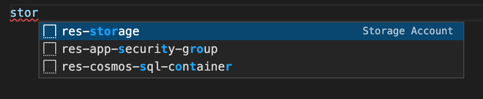
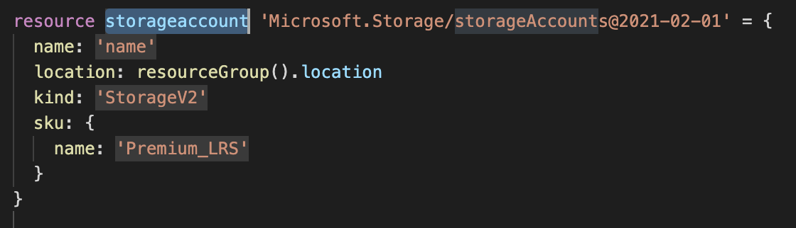
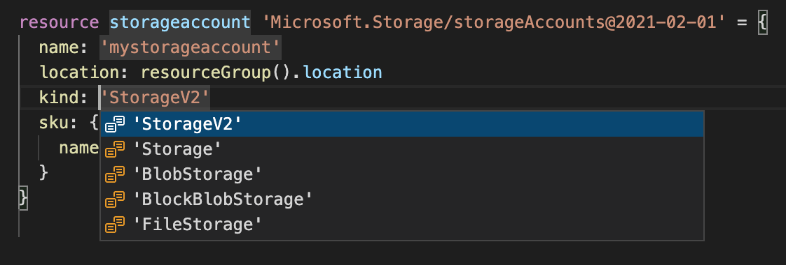
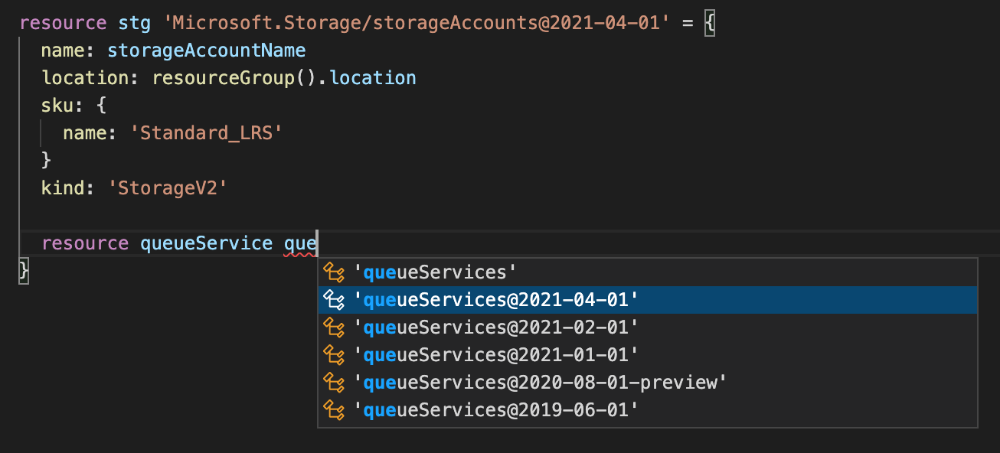
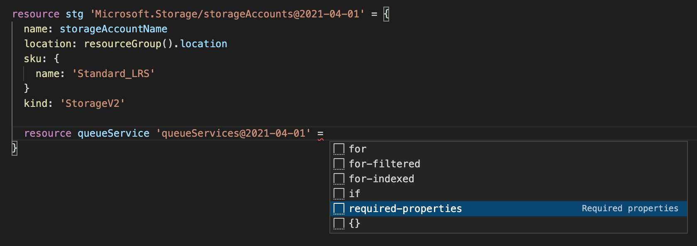

# Lab 3 - Bicep 101

In this lab, you will learn the basics of Bicep, create a few resources and deploy them to Azure

Goals for this lab: 
- [Creating the Queue](#queue)
- [Add the Azure App Service](#appservice)
- [Optionally add logging to your Azure App Service](#appservicelogging)
- [Publish your code to Azure](#publishcode)

## Prerequisites
Make sure you have completed [Lab 2 - Building a modern web application using Blazor](Lab2-Blazor.md)
This lab also requires some basic knowledge about these common Azure services.
- [Azure Storage Accounts](https://docs.microsoft.com/en-us/azure/storage/common/storage-account-overview) 
- [Azure Queue Storage](https://docs.microsoft.com/en-us/azure/storage/queues/storage-queues-introduction)
- [Azure App Service](https://azure.microsoft.com/en-us/services/app-service)

## <a name="queue"></a> Creating the Queue
This workshop uses an Azure Storage Queue as its messaging service. That requires us to create an Azure Storage Account. 

Create a new file called main.bicep. The Bicep VS Code extension that you installed can help create resources as it provides a lot of snippets. Type 'stor' and the extension should provide you with a snippet.



Hitting enter will insert a default template for a storage account. You can now use the tab key to move over the highlighted areas and modify them.



Notice how the extension also lists the available options for, for example, the 'kind'.



The end result should look like the example below:
```arm

resource stg 'Microsoft.Storage/storageAccounts@2021-04-01' = {
  name: 'mystorageaccount'
  location: resourceGroup().location
  sku: {
    name: 'Standard_LRS'
  }
  kind: 'StorageV2'
}
```

The name of the storage account is now hardcoded. That is not ideal since you want to use this template for both your test and production environment. The names of resources should reflect that. In Bicep, you can use a parameter to provide values, like the environment, at runtime. 

Defining one looks like this:

```arm
param env string = 'tst'
```
You start with the keyword 'param', then give it a name and define its type. Optionally, you can set a default value like the 'tst' above. The same can be done for the location property of the storage account.

Next to parameters, we can use variables for values that you want to reuse across your templates. Creating a variable that holds the name of the storage account could look like this:
```arm
var storageAccountName = 'storblazor${env}001'
```

The result of using both parameters and a variable is shown below:
```arm
param env string = 'tst'
param location string = 'westeurope'

var storageAccountName = 'storblazor${env}001'

resource stg 'Microsoft.Storage/storageAccounts@2021-04-01' = {
  name: storageAccountName
  location: location
  sku: {
    name: 'Standard_LRS'
  }
  kind: 'StorageV2'
}
```

Now that we have defined a Storage Account, it is time to add the Queue. To do that, you first enable the Queue Services feature and then create a queue. For both of those services, there is no built-in snippet available. The extension in VS Code is still handy to create both services.

The `QueueService` is a child resource of the Storage Account, so you define it within the storage account resource. To create the `QueueService`, start typing 'resource queueService que' within the storage account resource as shown below.

As you can see, the extension helps to select the right resource and version. Hit enter and add an '=' to the line. As shown below, the extension again helps you by offering a few options. 


Selecting 'required-properties' will finish the resource by adding all properties that need a value. The name of the `QueueService` always needs to be 'default', so make that its name. The `Queue` is a child resource of the `QueueService` and can be added similarly. The result should resemble the below template:

```arm
resource stg 'Microsoft.Storage/storageAccounts@2021-04-01' = {
  name: storageAccountName
  location: resourceGroup().location
  sku: {
    name: 'Standard_LRS'
  }
  kind: 'StorageV2'

  resource queueService 'queueServices@2021-04-01' = {
    name: 'default'

    resource queue 'queues@2021-04-01' = {
      name: 'insurance'
    }
  }
}
```

## <a name="queue"></a> Deploy the Storage Account
To deploy the storage account, you first need a resource group. The below command allows you to create one.
```
az group create -l westeurope -n rg-blazorbicepworkshop-tst-001
```

Now that your resource group is ready, you can deploy the template using the command below:
```
az deployment group create --resource-group rg-blazorbicepworkshop-tst-001 --template-file main.bicep
```
When you do not provide values for the parameters, the defaults in the template will be used. The following command shows an example of how to give a parameter while deploying the template.
```
az deployment group create --resource-group rg-blazorbicepworkshop-tst-001 \
    --template-file main.bicep  \
    --parameters '{ \"env\": { \"value\": \"prd\" } }'
```

## <a name="appservice"></a> Add the Azure App Service
The Blazor app you have built in the previous lab will run on an Azure App Service. It consists of two resources; an App Service Plan and an App Service. An App Service Plan defines a set of compute resources. On top of the plan, you run one or more App Services that share the compute resources.

To create the Plan, type 'plan' and select 'res-app-plan'. Change the sku to 'B1' and give it a name. The resource should be similar to this example:
```arm
var serverFarmName = 'plan-blazor-${env}-001'

resource appServicePlan 'Microsoft.Web/serverfarms@2019-08-01' = {
  name: serverFarmName
  location: location
  sku: {
    name: 'B1'
    capacity: 1
  }
}
```
Creating the App Service is done using the 'res-web-app' snippet. Notice how the `serverFarmId` property is used to link this App Service to the plan you just created. There is one addition that you need to make to this template. Within the `properties` section, you need to add the required .NET Framework version. The Blazor app requires .NET 6 but as this is not the default value, you need to explicitly set it. The template should then resemble the below example:

```arm
var appServiceName = 'app-blazor-${env}-001'
resource webApplication 'Microsoft.Web/sites@2018-11-01' = {
  name: appServiceName
  location: location
  properties: {
    serverFarmId: appServicePlan.id
    
    siteConfig: {
      netFrameworkVersion: 'v6.0'
    }
  }
}
```
Remember how the Blazor app used an environment variables to get the connection information for the Storage Account Queue? Using Bicep, you can set these values as settings on your App Service while deploying it. To do that, add the appSettings property to the `siteConfig` section like this:

```
siteConfig: {
      netFrameworkVersion: 'v6.0'
      appSettings: [
      ]
    }
```

The `appSettings` property is an array and allows for multiple key-value pairs to be inserted. In this lab, you only need one for the Storage Account connection string. Using Bicep, you can create a variable to construct it:

```arm
var storageConnectionString = 'DefaultEndpointsProtocol=https;AccountName=${stg.name};EndpointSuffix=${environment().suffixes.storage};AccountKey=${stg.listKeys().keys[0].value}'
```
Notice how this line uses a reference to the Storage Account using the 'stg' object to get its name. It also uses the `.listKeys()` function to get an account key. Last but not least, it uses the `environment()` function to get the storage account base URL.

Below you will find the template containing the 'storageConnectionString' variable that is used in the appSettings array:

```arm
var storageConnectionString = 'DefaultEndpointsProtocol=https;AccountName=${stg.name};EndpointSuffix=${environment().suffixes.storage};AccountKey=${stg.listKeys().keys[0].value}'

var appServiceName = 'app-blazor-${env}-001'
resource webApplication 'Microsoft.Web/sites@2018-11-01' = {
  name: appServiceName
  location: location
  properties: {
    serverFarmId: appServicePlan.id
    
    siteConfig: {
      netFrameworkVersion: 'v6.0'
      appSettings: [
        {
          name: 'storageAccountConnectionString'
          value: storageConnectionString
        }
      ]
    }
  }
}
```
> WARNING: for the sake of simplicity, you have now set the connection string as a setting on the App Service. In a real-life scenario, that is not an option since that connection string will then be readably in plain-text in, for example, the Azure Portal. It's better to store this secret in Key Vault, or use a Managed Identity instead.

## <a name="appservicelogging"></a> Optionally add logging to your Azure App Service
To make your life a little easier while debugging your app on Azure, you could add the following resource to your template to enable logging on the App Service. It is a child resource and you will need to place it within the curly braces that describe your App Service Plan as shown below:
```arm
resource webApplication 'Microsoft.Web/sites@2018-11-01' = {
    name: appServiceName
    ...
    resource logs 'config@2021-01-15' = {
        name: 'logs'
        properties: {
        httpLogs: {
            fileSystem: {
            enabled: true
            retentionInDays: 2
            retentionInMb: 35
            }
        }
        detailedErrorMessages: {
            enabled: true
        }
        applicationLogs: {
            fileSystem: {
            level: 'Verbose'
            }
        }
        failedRequestsTracing: {
            enabled: true
        }
        }
    }
}
  ```

## <a name="publishcode"></a> Publish your code to Azure

Copy the packaged Blazor app from the 'publish' folder to the current directory, and publish it to your App Service Plan by using these commands:

```
copy D:\Projects\clubcloud\XpiritInsurance\Server\bin\Release\net6.0\publish\package.zip .
az webapp deploy --resource-group rg-blazorbicepworkshop-tst-001 --name app-blazor-tst-001 --src-path package.zip
```

You should now be able to navigate to your app, log in, and buy a new insurance policy!
